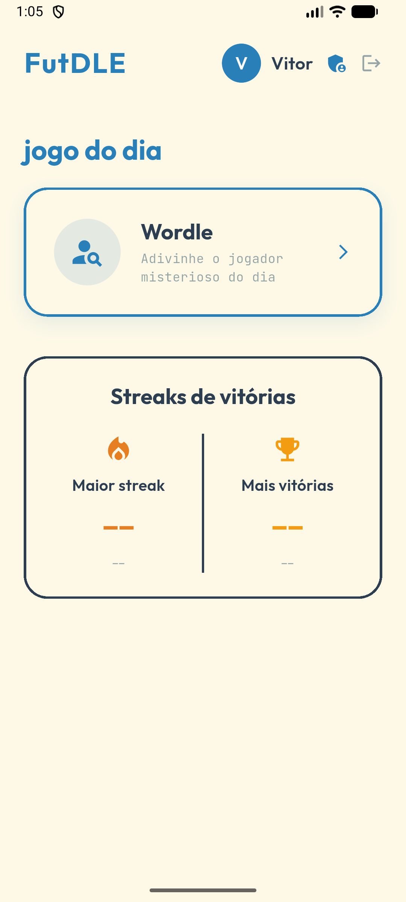
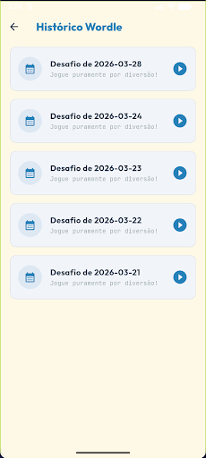
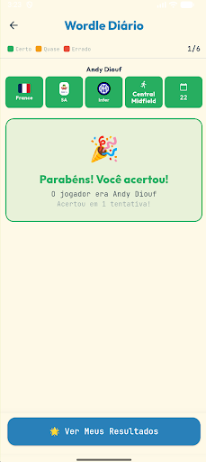
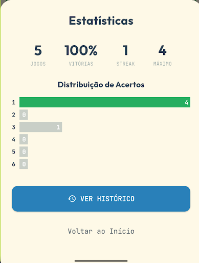
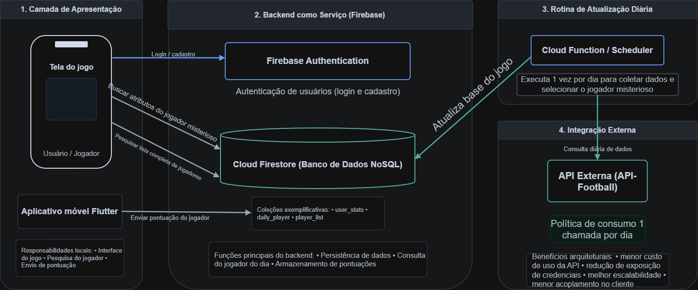

<p align="center">
  <h1 align="center">⚽ FutDLE</h1>
  <p align="center">
    Um jogo mobile estilo <strong>Wordle</strong> focado em jogadores de futebol.<br/>
    Adivinhe o jogador misterioso do dia comparando atributos como nacionalidade, liga, time, posição e idade.
  </p>
</p>

<p align="center">
  
  
  
  
  
</p>

---
> 📱 **[Clique aqui para baixar o APK do jogo](sha256:cebfa0d29cf7e44c4c6cc03ed7553f2c1863a2a3052e95801c7106f95750a26e)**
---

## 📸 Screenshots

<p align="center">
  
  
  
  
  
</p>

---

## 🎮 Como Funciona

O FutDLE é inspirado no [Wordle](https://www.nytimes.com/games/wordle), mas adaptado para o universo do futebol:

1.  **Todo dia** um novo jogador misterioso é sorteado automaticamente.
2.  O jogador pesquisa e escolhe um palpite digitando o nome de um jogador de futebol.
3.  Cada palpite revela **dicas visuais** através de cores:
    - 🟩 **Verde** → atributo idêntico ao jogador misterioso
    - 🟨 **Amarelo** → atributo parcialmente correto (ex: mesma liga, time diferente)
    - 🟥 **Vermelho** → atributo completamente diferente
    - ⬆️⬇️ **Setas de idade** → indicam se o misterioso é mais velho ou mais novo
4.  O jogador tem **6 tentativas** para acertar.
5.  Estatísticas de **streaks**, **vitórias** e **distribuição de palpites** são salvas no perfil.

---

## 🏗️ Arquitetura

O projeto segue uma arquitetura modular organizada em **camadas**:

<p align="center">
  
</p>

### Visão Geral

| Camada | Responsabilidade |
|---|---|
| **Apresentação** | UI Flutter (páginas, componentes, tema) |
| **Backend-as-a-Service** | Firebase Auth + Cloud Firestore |
| **Rotina Diária** | Cloud Function que sorteia o jogador do dia |
| **Integração Externa** | Consumo da API [football-data.org](https://www.football-data.org/) |

### Estrutura de Pastas

```
lib/
├── main.dart                     # Entry point do app
├── firebase_options.dart         # Config Firebase gerada automaticamente
│
├── core/                         # Camada compartilhada
│   ├── api/                      # Cliente HTTP e constantes da API
│   │   ├── api_constants.dart    # Base URL, ligas top-5, temporada atual
│   │   └── api_service.dart      # Requisições à football-data.org
│   ├── di/                       # Injeção de dependência (GetIt)
│   │   └── injection.dart
│   ├── exceptions/               # Exceções customizadas
│   │   └── app_exceptions.dart
│   ├── firebase/                 # Serviços Firebase
│   │   ├── auth_service.dart     # Login, cadastro, logout
│   │   ├── firestore_service.dart# CRUD: jogadores, stats, daily player
│   │   └── import_players.dart   # Script de importação em lote
│   ├── logger/                   # Logger centralizado
│   ├── managers/                 # Lógica de negócio
│   │   └── daily_player_manager.dart  # Sorteia jogador do dia
│   ├── models/                   # Modelos de dados
│   │   ├── player_model.dart     # Jogador + estatísticas
│   │   ├── user_stats.dart       # Streak, vitórias, distribuição
│   │   └── mini_game_model.dart  # Definição dos mini jogos
│   ├── theme/                    # Design system
│   │   ├── app_colors.dart       # Paleta de cores
│   │   └── app_theme.dart        # ThemeData do Material
│   └── utils/                    # Utilitários
│       └── country_code_mapper.dart  # Mapeia nacionalidade → código ISO
│
├── features/                     # Feature modules
│   ├── admin/                    # Painel administrativo
│   │   └── pages/
│   │       └── admin_page.dart   # Sorteio manual, importação
│   ├── auth/                     # Autenticação
│   │   ├── auth_gate.dart        # Decide Login ou Home via stream
│   │   ├── controllers/
│   │   │   └── auth_controller.dart
│   │   └── pages/
│   │       ├── login_page.dart
│   │       └── register_page.dart
│   ├── home/                     # Tela principal
│   │   ├── components/
│   │   │   ├── daily_games_grid.dart  # Grid dos mini jogos
│   │   │   ├── home_header.dart       # Header com avatar e nome
│   │   │   └── streak_card.dart       # Card de streaks
│   │   └── pages/
│   │       └── home_page.dart
│   └── wordle/                   # Jogo principal
│       ├── wordle_game_logic.dart     # Motor de comparação
│       ├── components/
│       │   ├── player_guess_row.dart  # Linha de resultado do palpite
│       │   ├── player_search_field.dart # Campo de busca com autocomplete
│       │   └── wordle_stats_modal.dart  # Modal de estatísticas
│       └── pages/
│           ├── wordle_page.dart        # Tela do jogo
│           └── wordle_history_page.dart # Histórico de partidas
```

---

## 🛠️ Stack Tecnológica

| Tecnologia | Uso |
|---|---|
| [Flutter](https://flutter.dev/) | Framework UI multiplataforma |
| [Dart](https://dart.dev/) `^3.11.1` | Linguagem de programação |
| [Firebase Auth](https://firebase.google.com/docs/auth) | Autenticação (email/senha) |
| [Cloud Firestore](https://firebase.google.com/docs/firestore) | Banco de dados NoSQL em tempo real |
| [football-data.org API](https://www.football-data.org/) | Dados de jogadores, times e ligas |
| [GetIt](https://pub.dev/packages/get_it) | Injeção de dependência / Service Locator |
| [Google Fonts](https://pub.dev/packages/google_fonts) | Tipografia customizada |
| [country_flags](https://pub.dev/packages/country_flags) | Bandeiras das nacionalidades |
| [cached_network_image](https://pub.dev/packages/cached_network_image) | Cache de imagens (escudos, fotos) |
| [flutter_dotenv](https://pub.dev/packages/flutter_dotenv) | Variáveis de ambiente |

---

## 🚀 Como Rodar

### Pré-requisitos

- [Flutter SDK](https://docs.flutter.dev/get-started/install) `≥ 3.x`
- [Firebase CLI](https://firebase.google.com/docs/cli)
- Conta no [football-data.org](https://www.football-data.org/client/register) (gratuita — 10 requests/min)

### 1. Clone o repositório

```bash
git clone https://github.com/VitorFcosta/futdle.git
cd futdle
```

### 2. Configure as variáveis de ambiente

Crie um arquivo `.env` na raiz do projeto baseado no `.env.example`:

```bash
cp .env.example .env
```

Preencha com sua chave da API:

```env
API_KEY=sua_chave_da_api_sports_aqui
```

### 3. Configure o Firebase

```bash
# Instale o Firebase CLI (se ainda não tiver)
npm install -g firebase-tools

# Login
firebase login

# Inicialize o projeto (ou use o firebase.json existente)
flutterfire configure
```

### 4. Instale as dependências e rode

```bash
flutter pub get
flutter run
```

---

## 🔑 Collections do Firestore

| Collection | Descrição |
|---|---|
| `player_list` | Lista completa de jogadores importados da API |
| `daily_player` | Jogador misterioso do dia (sobrescrito diariamente) |
| `user_stats` | Estatísticas de cada usuário (streak, vitórias, distribuição) |

---

## 🏆 Ligas Cobertas

O FutDLE inclui jogadores das **5 maiores ligas da Europa**:

| Código | Liga |
|---|---|
| `PL` | 🏴󠁧󠁢󠁥󠁮󠁧󠁿 Premier League |
| `PD` | 🇪🇸 La Liga |
| `SA` | 🇮🇹 Serie A |
| `BL1` | 🇩🇪 Bundesliga |
| `FL1` | 🇫🇷 Ligue 1 |

---

## 🎨 Design System

O app segue uma paleta visual coesa e amigável:

| Token | Cor | Hex | Uso |
|---|---|---|---|
| `primary` | 🔵 | `#2980B9` | Títulos, destaques, botões |
| `dark` | ⚫ | `#2C3E50` | Bordas, textos fortes |
| `background` | 🟡 | `#FEF9E7` | Fundo das telas e cards |
| `success` | 🟢 | `#27AE60` | Acerto (🟩) |
| `error` | 🔴 | `#E74C3C` | Erro (🟥) |
| `warning` | 🟠 | `#F39C12` | Parcial (🟨) |
| `grey` | ⚪ | `#95A5A6` | Textos secundários |

---

## 📁 Scripts Utilitários

| Script | Descrição |
|---|---|
| `assets/fetch_and_import_players.dart` | Importa todos os jogadores das top-5 ligas para o Firestore via API |
| `get_nats.dart` | Lista todas as nacionalidades únicas dos jogadores importados |

---

## 📄 Licença

Este projeto está sob a licença MIT. Veja o arquivo [LICENSE](LICENSE) para mais detalhes.

---
